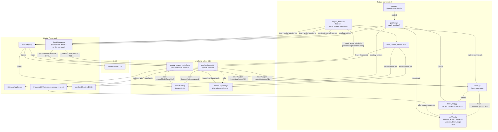
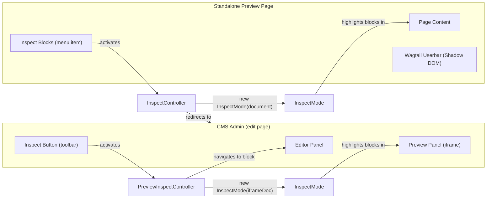
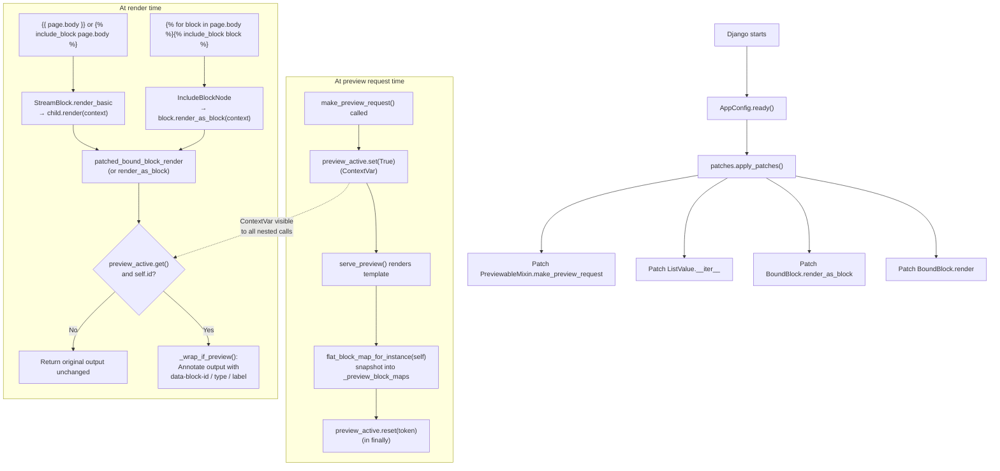
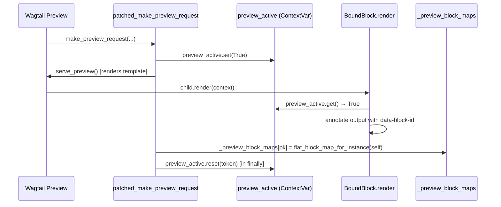
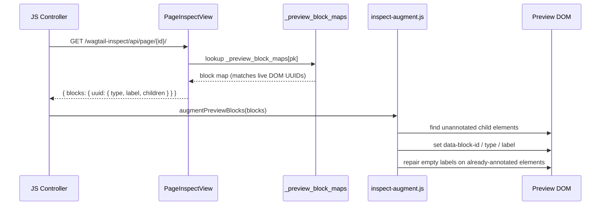
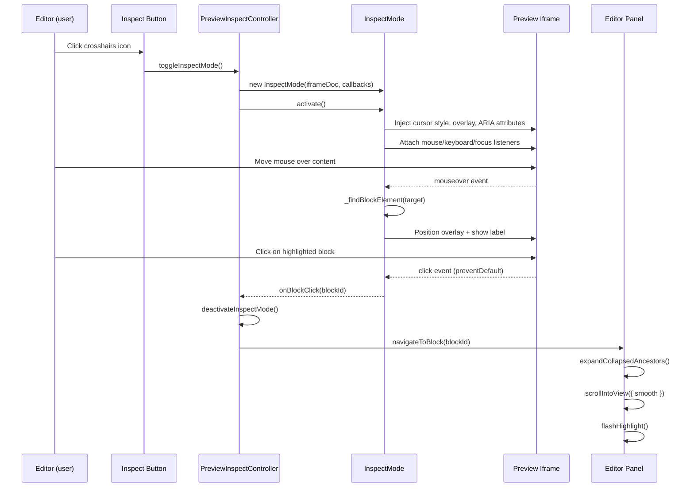
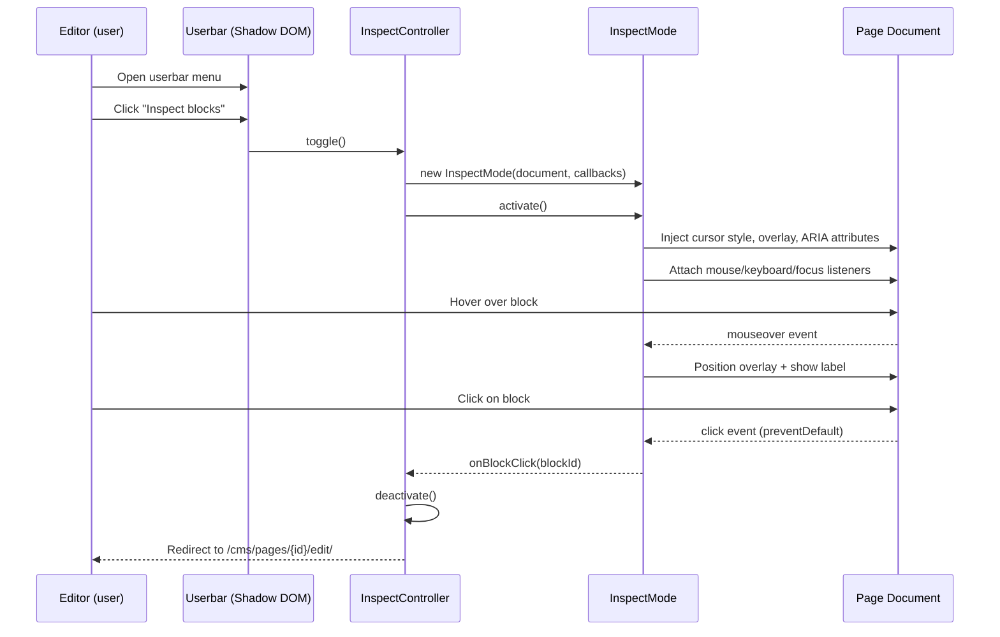
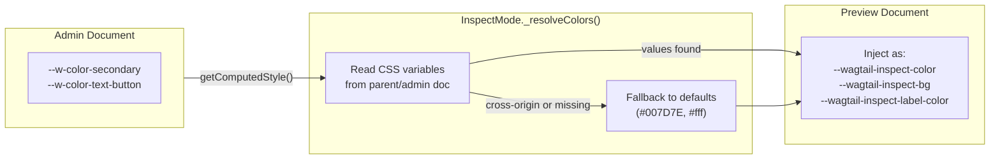

# Architecture Overview

This document describes how the Wagtail Inspect plugin is structured, how data flows through it, and how its components interact.

## Core Idea

Wagtail renders StreamField content as plain HTML -- there is no built-in way to trace a rendered block back to the editor panel that produced it. This plugin closes that gap by:

1. **Tagging** every rendered `BoundBlock` with `data-block-id`, `data-block-type`, and `data-block-label` attributes (Python-side monkey-patches on `BoundBlock.render`, `BoundBlock.render_as_block`, and `ListValue.__iter__`).
2. **Augmenting** any blocks the Python patches missed (e.g. blocks rendered via `django-includecontents` or raw template loops) using `inspect-augment.js`, which reads a block map built from the page's data model by `block_map.py`.
3. **Signalling** preview mode via a `ContextVar` set by a patch on `PreviewableMixin.make_preview_request`, rather than thread-local state or URL matching.
4. **Detecting** those tagged elements in the preview and letting the user hover/click them (JavaScript-side controllers).
5. **Navigating** from the clicked block back to the correct editor section in the Wagtail admin (DOM traversal, panel expansion, scroll, flash highlight).

## High-Level Component Map



## Two Integration Modes

The plugin operates in two distinct contexts, each with its own JavaScript controller. Both controllers delegate the visual inspect experience to the shared `InspectMode` class:



### Mode 1: CMS Preview Panel (iframe)

Used when an editor has the page open in the Wagtail admin at `/cms/pages/{id}/edit/` and toggles the side preview panel.

- **Controller**: `PreviewInspectController` (Stimulus)
- **Where it runs**: In the admin page, interacting with the preview iframe's document
- **InspectMode target**: `iframe.contentDocument` (cross-frame)
- **Navigation**: In-page -- finds the `[data-contentpath]` element in the editor panel, expands collapsed panels, scrolls to it, and flashes a highlight
- **File**: `preview-inspect-controller.js`

### Mode 2: Standalone Preview Page (userbar)

Used when an editor opens the full preview at `/cms/pages/{id}/edit/preview/`.

- **Controller**: `InspectController` (plain JS)
- **Where it runs**: Directly on the preview page's document
- **InspectMode target**: `document` (same frame)
- **Navigation**: Full-page redirect to `/cms/pages/{id}/edit/#block-{uuid}-section`
- **File**: `userbar-inspect.js`

## Block Rendering Pipeline

The Python side patches Wagtail's block rendering so that every `BoundBlock` with a UUID has its HTML output annotated with `data-block-*` attributes. This happens at Django startup time via the `AppConfig.ready()` hook.



### Three Patches, Two Rendering Entry Points

Two `BoundBlock` methods are patched because Wagtail templates use two distinct rendering paths:

| Template syntax                                         | Wagtail method patched       | Patch function                        | Notes                                               |
| ------------------------------------------------------- | ---------------------------- | ------------------------------------- | --------------------------------------------------- |
| `{{ page.body }}` or ``    | `BoundBlock.render`          | `patched_bound_block_render`          | Called by `StreamBlock.render_basic` for each child |
| `` | `BoundBlock.render_as_block` | `patched_bound_block_render_as_block` | Called by `IncludeBlockNode` when iterating         |

Both methods delegate to `self.block.render(self.value, context)` internally; they never call each other, so there is no double-annotation.

### Preview Detection via ContextVar

Preview detection uses a `ContextVar[bool]` named `preview_active` (defined in `__init__.py`), set by patching `PreviewableMixin.make_preview_request`:



`ContextVar` is async-safe (unlike `threading.local`) and is visible to all rendering calls in the same execution context without requiring a template context argument.

The block map snapshot is taken **after** `serve_preview()` returns, at which point `self` has been updated with form-submitted field data. This means the map's UUIDs match those in the just-rendered DOM, even when Wagtail's form round-trip produces different UUIDs from the saved revision.

### Why `BoundBlock` Instead of `IncludeBlockNode`

`BoundBlock` is the common base class of both `StreamValue.StreamChild` and `ListValue.ListChild`. Patching at this level:

- Covers **both** rendering entry points (`render` for stream-level iteration, `render_as_block` for explicit ``).
- **Automatically covers `ListChild`** objects (UUID-bearing `ListBlock` items), which `IncludeBlockNode` patching missed.
- Guards against wrapping by checking `getattr(self, "id", None)` — plain `BoundBlock` instances with no `.id` are silently skipped.

### Block Annotation Strategy

Block metadata is attached to the DOM using a three-path strategy in `_wrap_if_preview`:

**Primary — attribute injection:** `_inject_attrs_into_root` locates the first HTML element in the rendered output via a compiled regex and inserts `data-block-id`, `data-block-type`, and `data-block-label` directly into that element's opening tag. No wrapper element is emitted, so CSS Grid and Flexbox layouts are completely unaffected.

```html
<!-- Before annotation -->
<section class="hero">…</section>

<!-- After annotation -->
<section data-block-id="…" data-block-type="hero" data-block-label="Hero" class="hero">…</section>
```

**Multi-root wrapper:** when the rendered output contains more than one top-level HTML element (e.g. a markdown block rendered as several sibling `<p>` tags), injecting on the first tag would only annotate part of the block. In this case, a `<div style="display:contents">` wrapper is emitted around the full fragment so the whole block shares one `data-block-id`. `_is_multi_root_fragment` (backed by `_RootCounter`, an `HTMLParser` subclass) detects this case in a single pass.

**Text-only fallback:** when the block output contains no HTML element (e.g. a bare `CharBlock` rendering plain text), the same `<div style="display:contents">` wrapper is used. Text-only output cannot be a grid item, so layout impact is moot.

`_getBlockRect()` in `InspectMode` handles all three cases:

```javascript
_getBlockRect(element) {
    const rect = element.getBoundingClientRect();
    if (rect.width > 0 || rect.height > 0) return rect;
    // Fallback for display:contents wrappers — union direct child rects
    // (Range API only as last resort for text-only wrappers with no element children)
    ...
}
```

## Block Map Augmentation Pipeline

Some blocks are invisible to the Python rendering patches because their DOM elements are created by template code that doesn't call `BoundBlock.render` or `BoundBlock.render_as_block` (e.g. `django-includecontents` components, or raw `` loops without ``). The augmentation pipeline handles these:



`PreviewInspectController` additionally injects `inspect-augment.js` into the preview iframe before calling `augmentPreviewBlocks`, since the script must run inside the same document as the DOM it is annotating.

## Inspect Mode Interaction Flow

### CMS Preview Panel



### Standalone Preview Page



## Theme Bridging

The inspect overlay needs to match Wagtail's active theme (light, dark, or auto). Since the preview iframe may not have Wagtail's CSS variables, `InspectMode` bridges the theme at activation time:



## Cross-Frame Communication

- **Standalone preview** (`userbar-inspect.js`): the userbar runs on the preview page; clicking a block sets `window.location` to the edit URL with `#block-{uuid}-section` (full navigation, no `postMessage`).
- **Editor preview panel** (`preview-inspect-controller.js`): `InspectMode` runs in the **iframe** document; clicking a block calls `navigateToBlock()` in the **parent** admin window (same process, direct DOM access — no `postMessage` for navigation). `inspect-augment.js` is injected into the iframe so it runs in the iframe's document context and can annotate the iframe's DOM directly.

## URL Hash Convention

The plugin uses a URL hash format to deep-link to specific blocks:

```
#block-{uuid}-section
```

This hash is:

- Set by `navigateToBlock()` via `history.pushState()` in the CMS admin
- Used as the target anchor when the userbar redirects to the edit page
- Detected on page load by `scrollToHashBlock()` to auto-navigate after redirect (uses instant scroll to avoid layout-shift interference from Wagtail's side panels)

## Data Attributes Reference

| Attribute                             | Where                                                            | Purpose                                                                           |
| ------------------------------------- | ---------------------------------------------------------------- | --------------------------------------------------------------------------------- |
| `data-block-id`                       | Preview HTML (block root element, or `display:contents` wrapper) | UUID of the StreamField block                                                     |
| `data-block-type`                     | Preview HTML (same element)                                      | Block type slug (e.g., `"hero"`, `"stat_list_block"`)                             |
| `data-block-label`                    | Preview HTML (same element)                                      | Human-readable block label (e.g., "Hero", "Stat List")                            |
| `data-contentpath`                    | Admin editor panel                                               | Wagtail's native attribute on block editor sections, value matches the block UUID |
| `data-controller`                     | Admin preview panel                                              | Stimulus controller identifier (`w-preview preview-inspect`)                      |
| `data-w-preview-target`               | Admin preview panel                                              | Stimulus target for the preview iframe (`iframe`)                                 |
| `data-preview-inspect-button`         | Admin preview toolbar                                            | Marker on the injected inspect button                                             |
| `data-wagtail-inspect-userbar-target` | Userbar template                                                 | Target for the inspect trigger button (`trigger`)                                 |
