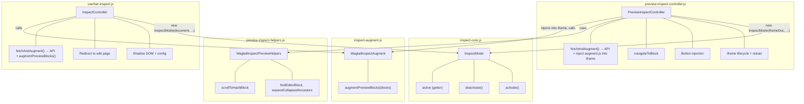
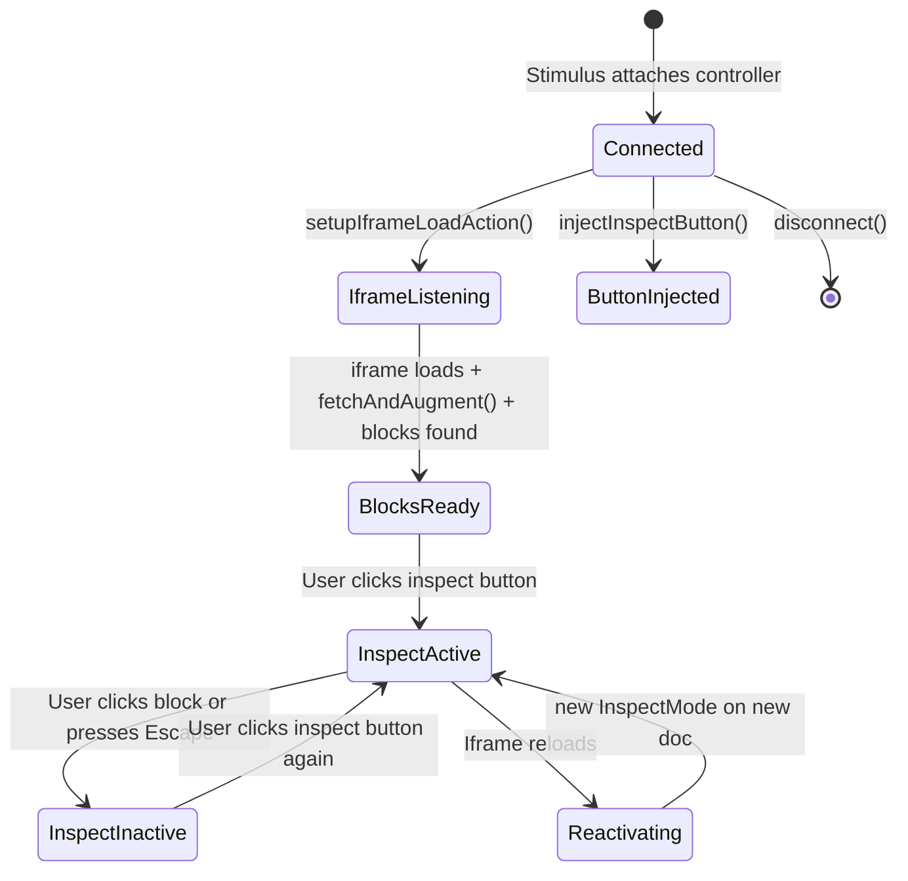
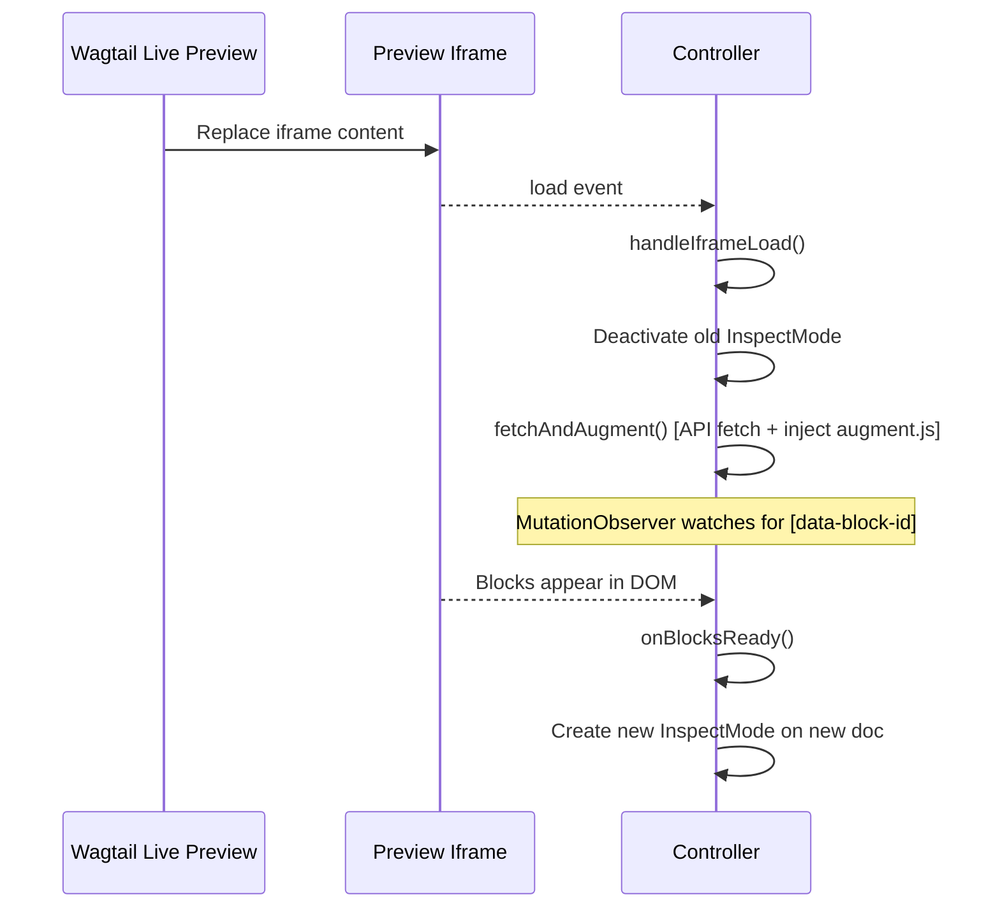

# Front-End Controllers Deep Dive

This document covers the JavaScript modules that power the inspect feature:

1. **`inspect-core.js`** -- shared `InspectMode` class (overlay, highlighting, events, accessibility)
2. **`inspect-augment.js`** -- DOM augmentation utility (annotates blocks that Python patches missed)
3. **`preview-inspect-helpers.js`** -- editor block lookup, panel expansion, hash scroll (`window.WagtailInspectPreviewHelpers`); loaded before the Stimulus controller
4. **`preview-inspect-controller.js`** -- Stimulus controller for the CMS admin preview panel
5. **`userbar-inspect.js`** -- plain-JS controller for standalone preview pages

## Table of Contents

- [Architecture overview](#architecture-overview)
- [Controller comparison](#controller-comparison)
- [`InspectMode` -- shared core](#inspectmode----shared-core)
  - [Public API](#public-api)
  - [Overlay system](#overlay-system)
  - [Event handling](#event-handling)
  - [Bounding rect and overlay positioning](#bounding-rect-and-overlay-positioning)
  - [Accessibility features](#accessibility-features)
  - [Theme bridging](#theme-bridging)
- [`inspect-augment.js` -- DOM augmentation](#inspect-augmentjs----dom-augmentation)
  - [Why augmentation is needed](#why-augmentation-is-needed)
  - [Augmentation strategy](#augmentation-strategy)
  - [`_findSiblingGroup` and the two-children fix](#_findsiblinggroup-and-the-two-children-fix)
  - [Label repair pass](#label-repair-pass)
  - [Public surface](#public-surface)
- [`PreviewInspectController` -- CMS admin preview panel](#previewinspectcontroller----cms-admin-preview-panel)
  - [Registration and auto-attachment](#registration-and-auto-attachment)
  - [Lifecycle](#lifecycle)
  - [Button injection](#button-injection)
  - [Iframe access](#iframe-access)
  - [Inspect mode lifecycle](#inspect-mode-lifecycle)
  - [Block map fetch and augmentation](#block-map-fetch-and-augmentation)
  - [Iframe reload handling](#iframe-reload-handling)
  - [Block navigation](#block-navigation)
  - [URL hash navigation](#url-hash-navigation)
- [`InspectController` -- Standalone preview page](#inspectcontroller----standalone-preview-page)
  - [IIFE structure](#iife-structure)
  - [Shadow DOM initialization](#shadow-dom-initialization)
  - [Configuration loading](#configuration-loading)
  - [Block map fetch and augmentation](#block-map-fetch-and-augmentation-1)
  - [Activate / deactivate cycle](#activate--deactivate-cycle)
  - [Block navigation (redirect)](#block-navigation-redirect)
- [CSS: `preview-inspect.css`](#css-preview-inspectcss)

---

## Architecture Overview



All shared inspect-mode behavior (overlay, highlighting, cursor, event handling, accessibility) lives in `InspectMode`. Each controller creates an instance with a target document and callbacks, then calls `activate()` / `deactivate()` as needed.

Block map augmentation is handled by `WagtailInspectAugment` from `inspect-augment.js`. `PreviewInspectController` injects the script into the preview iframe and calls `augmentPreviewBlocks` there; `InspectController` calls `augmentPreviewBlocks` on the page document directly.

---

## Controller Comparison

| Aspect              | `PreviewInspectController`                                                                                       | `InspectController`                                                                                                             |
| ------------------- | ---------------------------------------------------------------------------------------------------------------- | ------------------------------------------------------------------------------------------------------------------------------- |
| **File**            | `preview-inspect-controller.js`                                                                                  | `userbar-inspect.js`                                                                                                            |
| **Framework**       | Stimulus (`window.StimulusModule.Controller`)                                                                    | Plain JavaScript (IIFE)                                                                                                         |
| **Context**         | CMS admin page (operates on preview iframe)                                                                      | Standalone preview page (operates on page document)                                                                             |
| **Trigger**         | Crosshairs button injected into preview toolbar                                                                  | "Inspect blocks" menu item in Wagtail userbar                                                                                   |
| **Target document** | `iframe.contentDocument` (cross-frame)                                                                           | `document` (same frame)                                                                                                         |
| **Navigation**      | In-page: scroll to `[data-contentpath]` in editor panel                                                          | Full redirect to `/cms/pages/{id}/edit/#block-{uuid}-section`                                                                   |
| **Augmentation**    | Fetches block map from API; injects `inspect-augment.js` into iframe; calls `augmentPreviewBlocks` inside iframe | Fetches block map from API via `apiUrl` from config; calls `window.WagtailInspectAugment.augmentPreviewBlocks` on page document |
| **Iframe reload**   | Handles via `MutationObserver` + `onBlocksReady`                                                                 | N/A (no iframe)                                                                                                                 |
| **Shadow DOM**      | No                                                                                                               | Yes (userbar lives in Shadow DOM)                                                                                               |
| **postMessage**     | N/A                                                                                                              | N/A                                                                                                                             |

---

## `InspectMode` -- Shared Core

**File:** `inspect-core.js` -- no framework dependencies, exposed as `window.WagtailInspectMode`.

`InspectMode` encapsulates everything about the visual inspect experience: the highlight overlay, crosshair cursor, mouse/keyboard/focus event handling, ARIA accessibility, and theme color resolution. It is document-agnostic -- the caller passes the target `Document` (an iframe document or the page document) and two callbacks.

### Public API

```javascript
const mode = new InspectMode(doc, {
  onBlockClick: (blockId) => {
    /* handle navigation */
  },
  onEscape: () => {
    /* handle deactivation */
  },
});

mode.activate(); // Create overlay, inject cursor, attach listeners, add ARIA
mode.deactivate(); // Remove everything, safe to call multiple times
mode.active; // Boolean getter

// Trigger click on the currently highlighted block (for keyboard use from parent doc)
mode.activateHighlightedBlock(event);
```

- **`doc`** -- The `Document` object to operate on. All DOM elements (overlay, cursor style, ARIA attributes) and event listeners are scoped to this document.
- **`onBlockClick(blockId)`** -- Called when the user clicks a block (or presses Enter/Space on a focused block). `InspectMode` handles `preventDefault` / `stopPropagation` and extracts the `data-block-id`. The callback is responsible for navigation.
- **`onEscape()`** -- Called when the user presses Escape. The callback should call `deactivate()` and update UI state.

`InspectMode` never auto-deactivates -- the controller decides when to call `deactivate()`. This gives controllers full control over the sequence (e.g., navigate first, then deactivate).

### Overlay System

The overlay is a `<div>` injected into the target document's `<body>`:

- `position: fixed` in the preview iframe's viewport, aligned to `getBoundingClientRect()` (no scroll-offset math)
- `pointer-events: none` so mouse events pass through to blocks underneath
- `z-index: 999999` to sit above all page content
- `transition: all 0.1s ease-out` for smooth repositioning between blocks
- `border: 2px solid var(--wagtail-inspect-color)` using resolved theme color
- `background: var(--wagtail-inspect-bg)` using semi-transparent theme color via `color-mix()`

A label element sits above the overlay (`top: -20px`) and shows the block type (e.g., "Hero", "Rich Text") in a themed pill.

When a block is hovered or focused, `_highlight()` positions the overlay over it and shows the label. `_unhighlight()` hides it when the mouse or focus leaves.

### Event Handling

All event listeners are added in the **capture phase** (`true` as the third argument) for `mouseover`, `mouseout`, `click`, `keydown`, `focusin`, and `focusout`. This ensures `InspectMode` intercepts events before any block-level handlers.

| Event                             | Behavior                                                                                  |
| --------------------------------- | ----------------------------------------------------------------------------------------- |
| `mouseover`                       | Find closest `[data-block-id]` ancestor, highlight it                                     |
| `mouseout`                        | Hide overlay only when moving to a non-block element (checks `relatedTarget`)             |
| `click`                           | `preventDefault` + `stopPropagation`, extract `blockId`, call `onBlockClick`              |
| `keydown`                         | Escape calls `onEscape`; Enter/Space on a block calls `onBlockClick`                      |
| `focusin`                         | Highlight the block containing the focused element                                        |
| `focusout`                        | Unhighlight when focus leaves a block (checks `relatedTarget`)                            |
| `resize`                          | Reposition overlay on the currently highlighted block                                     |
| `scroll` (capture, on `document`) | Same -- keeps the fixed overlay aligned while the page or a nested scroll container moves |

The cursor is forced to crosshair on all elements via an injected `<style>` tag (`* { cursor: crosshair !important }`), which is removed on deactivation.

### Bounding Rect and Overlay Positioning

`data-block-*` attributes are injected directly onto the block's own root element, so that element has a real layout box. `_getBlockRect()` calls `getBoundingClientRect()` on the block root. When that rect is zero-sized (`display:contents` wrappers, including multi-root markdown), it unions `getBoundingClientRect()` of **direct child elements** only. The Range API is a last resort for text-only wrappers with no element children -- Range unions across deep descendants can produce absurd `left`/`width` in real browsers.

`_positionOverlay()` pads the rect (3px), enforces a 5px minimum size on tiny dimensions, then **intersects** the padded box with the viewport. That caps width/height and keeps `left`/`top` sane when a rect is still bogus or mostly off-screen.

When the padded block top is negative (the block extends above the viewport), the overlay `top` is clamped to `0`, but the breadcrumb label would still sit at the default CSS `top: -21.5px` relative to the overlay (mostly off-screen). In that case the code sets a fixed inline `top: -1.5px` on the label and `border-radius: 0 0 3px 3px` so the pill visually attaches to the top edge of the clipped overlay, instead of computing a dynamic offset from the label height.

The overlay uses `position: fixed` with viewport coordinates (not `scrollX`/`scrollY`). Moving the mouse or focusing another block recomputes the rect, so the highlight tracks blocks after scroll.

### Accessibility Features

`InspectMode` implements several accessibility patterns:

#### Keyboard Navigation

When activated, all `[data-block-id]` elements receive:

- `role="button"` -- announces them as interactive elements
- `tabindex="0"` -- makes them focusable and part of the tab order
- `aria-label="Inspect {blockLabel} block"` -- provides a screen reader label

These attributes are removed on deactivation via `_disableBlockAccessibility()`.

#### ARIA Live Region

A visually hidden `<div aria-live="polite" aria-atomic="true">` is injected into the document. When a block is highlighted (by hover or focus), the block's label is announced to screen readers via `_announce(message)`. The text is cleared and re-set in a `requestAnimationFrame` callback to ensure screen readers detect the change.

#### Focus-Visible Outline

An injected `<style>` rule adds a visible focus ring to blocks during keyboard navigation:

```css
[data-block-id]:focus-visible {
  outline: 2px solid var(--wagtail-inspect-color);
  outline-offset: 2px;
}
```

This only appears during keyboard navigation (not on mouse click) thanks to the `:focus-visible` pseudo-class.

### Theme Bridging

`InspectMode` resolves Wagtail's CSS custom properties at activation time to match the admin's current theme (light, dark, or auto):

```javascript
_resolveColors() {
    // Try to read --w-color-secondary and --w-color-text-button
    // from the parent/admin document
    const win = this.doc.defaultView;
    const parentDoc = win?.parent !== win ? win.parent.document : null;
    const sourceDoc = parentDoc || this.doc;
    const styles = sourceDoc.defaultView.getComputedStyle(sourceDoc.documentElement);
    // ... extract values, fall back to defaults
}
```

The resolved colors are injected as CSS custom properties into the target document:

| Property                        | Source                                       | Fallback              |
| ------------------------------- | -------------------------------------------- | --------------------- |
| `--wagtail-inspect-color`       | `--w-color-secondary`                        | `#007D7E`             |
| `--wagtail-inspect-bg`          | `color-mix(in srgb, color 15%, transparent)` | Semi-transparent teal |
| `--wagtail-inspect-label-color` | `--w-color-text-button`                      | `#fff`                |

If the parent document is cross-origin or the variables are not available (e.g., on standalone preview pages without Wagtail's admin CSS), the fallback defaults match Wagtail's default secondary palette.

---

## `inspect-augment.js` -- DOM Augmentation

**File:** `inspect-augment.js` -- no framework dependencies, exposed as `window.WagtailInspectAugment`.

This is a **pure utility module** -- it does nothing on its own when loaded and has no self-boot logic. Callers (`preview-inspect-controller.js` and `userbar-inspect.js`) fetch the block map from the API and invoke augmentation explicitly.

### Why Augmentation is Needed

The Python rendering patches (`patches.py`) annotate blocks rendered via `` and `{{ page.body }}`. Some rendering patterns bypass these entry points entirely:

- `` without `` -- the list item elements are created by the template, not by `BoundBlock.render_as_block`
- `django-includecontents` `` components -- uses a custom rendering path that doesn't call `BoundBlock` methods
- Any other custom rendering that doesn't go through `BoundBlock.render` or `BoundBlock.render_as_block`

`inspect-augment.js` closes this gap by using the block map (which Python builds from the data model, independent of template rendering) to locate and annotate the missing elements.

It also runs a **label repair pass** to fill in empty `data-block-type` / `data-block-label` attributes on elements that Python patches did annotate with a UUID but couldn't resolve a type or label for (e.g. inline StructBlock children where the parent ListBlock context was unavailable at render time).

### Augmentation Strategy

`augmentPreviewBlocks(blocks)` iterates every entry in the block map that has declared children:

1. **Skip if already annotated**: if all child UUIDs already appear as `[data-block-id]` in the DOM (Python patches handled them), skip this parent.
2. **Find the parent element**: `document.querySelector('[data-block-id="${parentId}"]')`. If the parent itself isn't in the DOM, skip.
3. **Find a sibling group**: `_findSiblingGroup(parentEl, unannotated.length)` searches within the parent element for a group of exactly the right number of children that look like list-item candidates (same tag or same class name).
4. **Annotate**: assign `data-block-id`, `data-block-type`, and `data-block-label` to each element in DOM order, matching the `children` array order from the block map.

### `_findSiblingGroup` and the Two-Children Fix

`_findSiblingGroup(ancestor, count)` recursively searches the DOM for a group of exactly `count` sibling elements (excluding already-annotated elements) where all siblings share the same tag name or the same class name.

The key fix for the two-children regression (bug [da0e15c3](da0e15c3-9c93-4ed0-b8e5-1315d6a95f34)): the function requires `kids.length === count` **before** any tag/class uniformity check. This eliminates false positives where an ancestor with more children happened to score higher under the old className-uniformity heuristic. By requiring an exact length match at each level first, only the correct group is returned.

### Label Repair Pass

After augmentation, `_repairEmptyLabels(blocks)` queries all `[data-block-id]` elements and fills in any empty `data-block-type` or `data-block-label` attributes using the block map. This handles cases where Python's `_wrap_if_preview` couldn't determine a label (e.g. when the block's `set_name()` was never called), but the server-side `block_map.py` could -- because it has access to the parent ListBlock's field name context.

### Public Surface

```javascript
window.WagtailInspectAugment = {
  augmentPreviewBlocks,
};
```

No auto-boot. Callers load this script, wait for it, then call `augmentPreviewBlocks(blocks)` with the map from the API.

---

## `PreviewInspectController` -- CMS Admin Preview Panel

This Stimulus controller provides the inspect mode inside the CMS editor's side preview panel. It is the more complex of the two controllers because it must interact across frame boundaries (admin page ↔ preview iframe) and handle live preview reloads.

### Registration and Auto-Attachment

The controller registers with Wagtail's Stimulus application:

```javascript
window.wagtail.app.register("preview-inspect", PreviewInspectController);
```

Since the preview panel already has `data-controller="w-preview"` set by Wagtail (and we cannot modify that template), a `MutationObserver` watches for preview panel elements and appends `preview-inspect` to their `data-controller` attribute dynamically.

### Lifecycle



#### `connect()`

1. Initializes state (`inspectModeActive = false`, `inspectMode = null`)
2. Pre-binds `handleKeyDown` handler
3. Injects the crosshairs button into the preview toolbar
4. Sets up iframe load action

#### `disconnect()`

Cleans up the block observer and calls `deactivateInspectMode()`.

### Button Injection

The inspect button is injected into `.w-preview__sizes` alongside device-size buttons. It uses Wagtail's built-in `w-preview__size-button` class and a crosshairs SVG icon from Wagtail's icon sprite. When active, it gets `aria-pressed="true"` and the `w-preview__size-button--selected` class.

The button's Stimulus action is set via `data-action="click->preview-inspect#toggleInspectMode"`.

### Iframe Access

Two helper methods abstract iframe access:

- `getPreviewIframe()` tries three selectors to be resilient across Wagtail versions:
  1. `[data-w-preview-target="iframe"]` (Stimulus target)
  2. `.w-preview__iframe` (CSS class)
  3. `#w-preview-iframe` (ID)
- `getPreviewDocument()` safely accesses `iframe.contentDocument` with a try/catch for cross-origin errors

### Inspect Mode Lifecycle

```javascript
activateInspectMode() {
    const previewDoc = this.getPreviewDocument();
    this.inspectMode = this._createInspectMode(previewDoc);
    this.inspectMode.activate();
    document.addEventListener('keydown', this.boundHandleKeyDown);
    this.inspectModeActive = true;
    this.updateButtonState();
}

deactivateInspectMode() {
    if (this.inspectMode) {
        this.inspectMode.deactivate();
        this.inspectMode = null;
    }
    document.removeEventListener('keydown', this.boundHandleKeyDown);
    this.inspectModeActive = false;
    this.updateButtonState();
}
```

The `_createInspectMode()` helper is factored out so iframe reloads can re-create an instance without duplicating the callback setup. The Escape key listener is added on the **admin document** separately (in addition to InspectMode's listener on the iframe document) so Escape works regardless of which frame has focus.

### Block Map Fetch and Augmentation

On each iframe load, the controller fetches the block map from the API and injects `inspect-augment.js` into the iframe to annotate elements the Python patches missed:

```javascript
async fetchAndAugment() {
    const config = window.wagtailInspectConfig;
    const pageId = this.getPageId();
    if (!config || !pageId) return;

    const res = await fetch(`${config.apiBase}${pageId}/`, {
        headers: { 'X-Requested-With': 'XMLHttpRequest' },
    });
    if (!res.ok) return;
    const { blocks } = await res.json();
    if (!blocks) return;

    const previewDoc = this.getPreviewDocument();
    await this.injectAugmentScript(previewDoc);
    previewDoc.defaultView?.WagtailInspectAugment?.augmentPreviewBlocks(blocks);
}
```

`injectAugmentScript(doc)` creates a `<script src="...">` element pointing at `window.wagtailInspectConfig.augmentScriptUrl` and appends it to the iframe's `<head>`. It is a no-op if the script is already present (duplicate guard). `getPageId()` extracts the numeric page ID from the admin URL path (`/pages/<id>/`).

### Iframe Reload Handling

Wagtail's live preview refreshes the iframe when the editor types. The controller survives these reloads:



1. `handleIframeLoad()` saves `shouldReactivateInspect`, cleans up the old `InspectMode` (whose document is now detached), calls `fetchAndAugment()`, then starts watching for blocks
2. `waitForBlocks()` uses a `MutationObserver` on the new iframe body to wait for `[data-block-id]` elements
3. `onBlocksReady()` creates a fresh `InspectMode` on the new document if inspect was previously active

### Block Navigation

Once the user clicks a block, `navigateToBlock(blockId)`:

1. Sets the URL hash to `#block-{uuid}-section` via `history.pushState`
2. Finds the editor element via `findEditorBlock(blockId)` -- tries `[data-contentpath]`, `#block-{id}-section`, then `[data-block-id]` as fallbacks
3. Calls `expandCollapsedAncestors()` to walk up the DOM and expand any collapsed `section.w-panel` elements
4. Scrolls the element into view with smooth animation
5. Calls `flashHighlight()` to add a CSS class that triggers a background-color fade animation

#### Panel Expansion

`expandCollapsedAncestors(element)` handles two cases:

- The element's own panel (if it is inside a `section.w-panel`)
- All ancestor panels up the DOM tree

For each collapsed panel, it removes the `hidden` attribute from `.w-panel__content` and sets `aria-expanded="true"` on `[data-panel-toggle]`.

### URL Hash Navigation

A standalone `scrollToHashBlock()` function (outside the Stimulus controller) runs on every editor page load. It checks for a `#block-{uuid}-section` hash in the URL, expands ancestors, and scrolls to the matching editor panel. This handles the redirect from standalone preview pages: when the userbar's `InspectController` redirects to the edit page with a block hash, this function picks it up automatically -- no Stimulus controller lifecycle needed.

It uses `scrollIntoView({ behavior: 'instant' })` rather than `'smooth'` because Wagtail's side panels and iframe loading cause layout shifts that interrupt smooth scroll animations.

---

## `InspectController` -- Standalone Preview Page

This controller handles inspect mode on standalone preview pages (e.g., `/cms/pages/{id}/edit/preview/`). It is simpler because there is no iframe boundary and no live reload to handle.

### IIFE Structure

The entire file is wrapped in an IIFE to avoid polluting the global scope. No Stimulus dependency -- this runs on preview pages where Wagtail's Stimulus application is not available.

### Shadow DOM Initialization

The Wagtail userbar renders inside a `<wagtail-userbar>` custom element with Shadow DOM. The `initialize()` function uses a `MutationObserver` to wait for `<wagtail-userbar>` and its shadow root to appear in the DOM, then finds `[data-controller="wagtail-inspect-userbar"]` inside it and creates the controller.

```javascript
function initialize() {
  if (tryAttach()) return;

  const observer = new MutationObserver(() => {
    if (tryAttach()) {
      observer.disconnect();
    }
  });
  observer.observe(document.documentElement, { childList: true, subtree: true });
}
```

`tryAttach()` returns `true` if the userbar and shadow root are ready; `false` otherwise. Using a `MutationObserver` instead of `setTimeout` polling means the controller connects as soon as the element appears, with no fixed retry interval or cap.

### Configuration Loading

Configuration comes from a `<script type="application/json" id="inspect-preview-configuration">` element rendered by Django's `json_script` filter inside Shadow DOM. The controller uses `this.shadowRoot.getElementById()`:

```javascript
loadConfiguration() {
    const configElement = this.shadowRoot.getElementById('inspect-preview-configuration');
    if (configElement) {
        const config = JSON.parse(configElement.textContent);
        this.editUrlValue = config.editUrl || '';
        this.apiUrl = config.apiUrl || '';
        this.pageIdValue = config.pageId || 0;
    }
}
```

`apiUrl` is the full URL to the page's block map API endpoint (e.g. `/cms/wagtail-inspect/api/page/42/`), injected from the server so the controller doesn't need to construct it.

### Block Map Fetch and Augmentation

`fetchAndAugment()` is called during `connect()`, before the user activates inspect mode, so augmentation runs eagerly:

```javascript
async fetchAndAugment() {
    if (!this.apiUrl) return;
    const res = await fetch(this.apiUrl, {
        headers: { 'X-Requested-With': 'XMLHttpRequest' },
    });
    if (!res.ok) return;
    const { blocks } = await res.json();
    if (blocks) {
        window.WagtailInspectAugment?.augmentPreviewBlocks(blocks);
    }
}
```

Unlike the preview controller (which must inject `inspect-augment.js` into an iframe), the userbar controller calls `window.WagtailInspectAugment` directly because the script was already loaded on the standalone preview page by the userbar template.

### Activate / Deactivate Cycle

```javascript
activate() {
    this.inspectMode = new window.WagtailInspectMode(document, {
        onBlockClick: (blockId) => {
            this.navigateToBlock(blockId);
            this.deactivate();
        },
        onEscape: () => {
            this.deactivate();
        },
    });
    this.inspectMode.activate();
    this.updateButtonState(true);
}

deactivate() {
    if (this.inspectMode) {
        this.inspectMode.deactivate();
        this.inspectMode = null;
    }
    this.updateButtonState(false);
}
```

The `updateButtonState()` method toggles `aria-pressed`, the `w-userbar__item--active` class, and the icon's color using Wagtail CSS variables.

### Block Navigation (Redirect)

Unlike the preview controller (which does in-page navigation), this controller performs a full-page redirect:

```javascript
navigateToBlock(blockId) {
    if (this.editUrlValue) {
        window.location.href = `${this.editUrlValue}#block-${blockId}-section`;
    }
}
```

`scrollToHashBlock()` in `preview-inspect-helpers.js` runs on editor page load (registered from `preview-inspect-controller.js`) to pick up the hash and scroll to the block.

---

## CSS: `preview-inspect.css`

The CSS file is minimal (~33 lines) and covers three things:

### 1. Button active state

When the inspect button is pressed, it gets a themed background matching Wagtail's secondary color:

```css
[data-preview-inspect-button][aria-pressed="true"] {
  background-color: var(--w-color-secondary);
  color: var(--w-color-text-button);
}
```

### 2. Focus-visible outline for inspectable blocks

During keyboard navigation in the admin, blocks get a visible focus ring:

```css
[data-block-id][role="button"]:focus-visible {
  outline: 2px solid var(--w-color-secondary);
  outline-offset: 2px;
}
```

This rule targets elements that have been made focusable by `InspectMode._enableBlockAccessibility()`.

### 3. Flash animation

A 2-second fade from Wagtail's secondary color to transparent, triggered when navigating to a block in the editor:

```css
@keyframes wagtail-inspect-flash {
  0% {
    background-color: color-mix(in srgb, var(--w-color-secondary) 15%, transparent);
  }
  100% {
    background-color: unset;
  }
}

.wagtail-inspect-flash {
  animation: wagtail-inspect-flash 2s ease-out forwards;
}
```

The `flashHighlight()` function adds and removes this class, using `void element.offsetWidth` to force a reflow between removal and re-addition (allowing the animation to replay).
