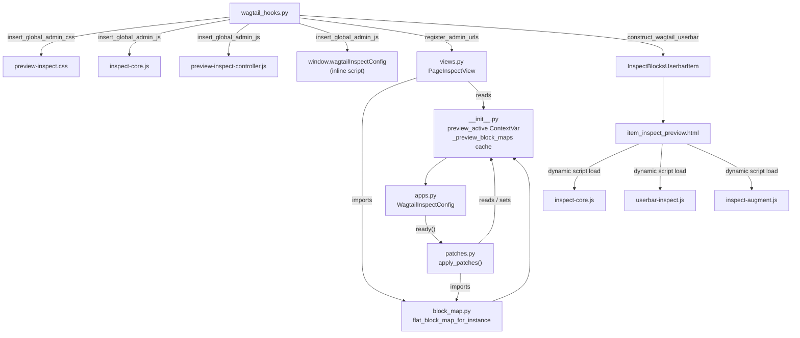

# Python Backend Deep Dive

This document covers every Python module in the plugin: the package initialization that exposes the `preview_active` ContextVar and the `_preview_block_maps` cache, the block map data layer, the Django app configuration that boots the patches, the monkey-patching system that injects block metadata into rendered HTML, the API view, and the Wagtail hooks that wire front-end assets and the userbar item.

## Table of Contents

- [Module overview](#module-overview)
- [`__init__.py` -- Package initialization and ContextVar](#__init__py----package-initialization-and-contextvar)
- [`apps.py` -- Django app configuration](#appspy----django-app-configuration)
- [`block_map.py` -- Block tree traversal](#block_mappy----block-tree-traversal)
  - [Public API](#public-api)
  - [Label and type resolution](#label-and-type-resolution)
  - [Tree traversal](#tree-traversal)
  - [Two-pass result building](#two-pass-result-building)
- [`patches.py` -- Block rendering patches](#patchespy----block-rendering-patches)
  - [Why monkey-patching?](#why-monkey-patching)
  - [What gets patched](#what-gets-patched)
  - [Multi-root detection](#multi-root-detection)
  - [Shared wrapping logic](#shared-wrapping-logic)
  - [The two BoundBlock patch functions](#the-two-boundblock-patch-functions)
  - [The ListValue patch](#the-listvalue-patch)
  - [The make_preview_request patch](#the-make_preview_request-patch)
  - [`apply_patches()` -- the entry point](#apply_patches----the-entry-point)
- [`views.py` -- Page Inspect API](#viewspy----page-inspect-api)
- [`wagtail_hooks.py` -- Wagtail integration](#wagtail_hookspy----wagtail-integration)
  - [Asset injection hooks](#asset-injection-hooks)
  - [`InspectBlocksUserbarItem`](#inspectblocksuserbaritem)
  - [Admin URL registration](#admin-url-registration)
  - [Userbar construction hook](#userbar-construction-hook)

---

## Module Overview



---

## `__init__.py` -- Package Initialization and ContextVar

```python
from contextvars import ContextVar

__version__ = "0.1.0"

preview_active: ContextVar[bool] = ContextVar(
    "wagtail_preview_active", default=False
)

_preview_block_maps: dict[int, dict] = {}
```

Responsibilities:

1. **Version tracking** -- `__version__` follows semver and is the single source of truth for the package version.
2. **ContextVar** -- `preview_active` is the mechanism that signals to the block rendering patches whether a preview response is currently being generated. It is set by the `patched_make_preview_request` patch (see `patches.py`) and read by `_wrap_if_preview()`.
3. **Block map cache** -- `_preview_block_maps` is a module-level `dict[int, dict]` keyed by page primary key. After each preview render, `patched_make_preview_request` snapshots `flat_block_map_for_instance(self)` into this dict. `PageInspectView` reads from it so the API always serves UUIDs that match the live preview DOM, even when Wagtail's form round-trip produces different UUIDs from those stored in the saved revision.

Using a `ContextVar` rather than `threading.local` makes preview detection async-safe and works regardless of whether a template context is available. The ContextVar is automatically scoped to the current execution context; ASGI workers handle concurrent requests without interference.

---

## `apps.py` -- Django App Configuration

```python
class WagtailInspectConfig(AppConfig):
    name = "ll.apps.wagtail_inspect"
    label = "wagtail_inspect"
    verbose_name = "Wagtail Inspect"
    default_auto_field = "django.db.models.AutoField"

    def ready(self):
        from . import patches
        patches.apply_patches()
```

### `ready()` -- Bootstrap

The `ready()` method fires once after Django has loaded all apps. This is where the monkey-patches are applied. The import is deferred (inside the method body) to avoid circular imports -- at module load time, Wagtail's block classes may not be fully initialized yet.

The patches applied at startup:

1. `BoundBlock.render` → `patched_bound_block_render` (wraps stream-level block output)
2. `BoundBlock.render_as_block` → `patched_bound_block_render_as_block` (wraps explicit `` output)
3. `ListValue.__iter__` → `patched_list_value_iter` (list iteration yields `_ListChildProxy` with UUIDs)
4. `PreviewableMixin.make_preview_request` → `patched_make_preview_request` (sets/resets `preview_active` ContextVar, snapshots block map)

### Why `label` is explicit

Both `name` and `label` are set so the `label` stays stable even if the app is installed under a different Python path.

---

## `block_map.py` -- Block Tree Traversal

This module is the authoritative server-side source of block data. It walks a page's StreamField tree from the data model, independent of how templates rendered the page, and returns a UUID-keyed dict that `inspect-augment.js` uses to annotate DOM elements the Python rendering patches missed.

### Public API

**`blocks_for_field(stream_value, parent_id=None)`** -- recursively yields `(uuid, block_type, block_label, parent_id, debug)` tuples for every `StreamChild` and `ListChild` in a `StreamValue`, including nested `ListBlock` and `StructBlock` trees.

**`flat_block_map_for_instance(page)`** -- iterates every `StreamField` on the page model, calls `blocks_for_field`, and returns a flat dict:

```python
{
    "<uuid>": {
        "type": "<block_type>",
        "label": "<block_label>",
        "children": ["<child_uuid>", ...],
    },
    ...
}
```

The `children` list is consumed by `inspect-augment.js` to match unannotated DOM elements to their block UUIDs in the correct order.

### Label and Type Resolution

Four public helpers resolve block metadata from any duck-typed object that has a `.block` attribute (`StreamChild`, `ListChild`, `BoundBlock`, `_ListChildProxy`):

**`resolve_block_type(block_holder, parent_label="")`** -- precedence:

1. `block_holder.block_type` (StreamChild -- set by StreamBlock)
2. `block_holder.block.name` (set by `set_name()`)
3. `block_holder.block.label` slugified
4. Class name slugified (e.g. `FeatureItemBlock` → `"feature_item"`)
5. `parent_label` slugified (singular of the enclosing ListBlock's field name)
6. `"item"`

**`resolve_block_label(block_holder, parent_label="")`** -- precedence:

1. `block_holder.block.label`
2. Class name split (e.g. `FeatureItemBlock` → `"Feature Item"`)
3. `parent_label` (singular of the enclosing ListBlock's field name)
4. `"Item"`

These same helpers are imported and used by `patches.py` so label resolution is consistent between the Python-annotated DOM attributes and the API block map.

### Tree Traversal

`blocks_for_field` iterates the top-level stream children and recursively calls `_recurse_value` on each child's `.value`:

- **`StreamValue`** → recursed via `blocks_for_field` (yields children with correct `parent_id`)
- **`ListValue`** → iterates `.bound_blocks`, derives `parent_label` from the `ListBlock`'s field name via `_parent_label_from_list_block`
- **`dict` (StructValue)** → iterates `.values()` to discover nested `StreamBlock` or `ListBlock` fields (StructBlock fields themselves carry no UUID and are not yielded as entries)

### Two-Pass Result Building

`flat_block_map_for_instance` collects all tuples in a first pass, then wires up parent → child relationships in a second pass. This avoids requiring the tree walk to build the `children` list in-order, which would require extra bookkeeping during recursion.

---

## `patches.py` -- Block Rendering Patches

This is the core backend module. It modifies how Wagtail renders StreamField blocks so that each block's HTML output is annotated with metadata attributes the JavaScript controllers can detect.

### Why Monkey-Patching?

Wagtail's `StreamField` rendering pipeline produces plain HTML with no block-level markers. There is no hook, signal, or template tag argument that lets you inject attributes around individual blocks. The only way to add `data-block-id` to every block's output is to patch the rendering methods themselves.

All patches are applied once at startup, guarded against double-application, and wrapped in `try/except` so a failure is logged without crashing the app.

### What Gets Patched

Four Wagtail methods are patched:

| Patched method                          | Target class                              | Template syntax covered                                 | Notes                                                                                        |
| --------------------------------------- | ----------------------------------------- | ------------------------------------------------------- | -------------------------------------------------------------------------------------------- |
| `BoundBlock.render`                     | `wagtail.blocks.BoundBlock`               | `{{ page.body }}`, ``      | Called by `StreamBlock.render_basic` for each child                                          |
| `BoundBlock.render_as_block`            | `wagtail.blocks.BoundBlock`               | `` | Called by `IncludeBlockNode` when iterating                                                  |
| `ListValue.__iter__`                    | `wagtail.blocks.list_block.ListValue`     | ``                         | Yields `_ListChildProxy` during preview so `` receives a bound block |
| `PreviewableMixin.make_preview_request` | `wagtail.models.preview.PreviewableMixin` | N/A (preview lifecycle)                                 | Sets `preview_active` ContextVar, snapshots block map after render                           |

**Why `BoundBlock` instead of `IncludeBlockNode`?**

`BoundBlock` is the common base class of both `StreamValue.StreamChild` and `ListValue.ListChild`. Patching at this level:

- Covers both template iteration patterns without requiring two different entry-point patches.
- Automatically covers `ListChild` objects (UUID-bearing `ListBlock` items).
- Guards against unwanted wrapping by checking `getattr(self, "id", None)` -- plain `BoundBlock` instances without an `.id` are silently skipped.

**Why two `BoundBlock` methods?**

`BoundBlock.render` and `BoundBlock.render_as_block` both delegate to `self.block.render(self.value, context)` but they are called from different places in Wagtail's rendering pipeline and never call each other. Patching both ensures full coverage without double-wrapping.

### Multi-Root Detection

The `_RootCounter` class (an `HTMLParser` subclass) counts top-level elements and non-whitespace text nodes in a single pass through the rendered output. `_is_multi_root_fragment(html)` returns `True` when the fragment has more than one meaningful top-level node (e.g. a markdown block rendered as several sibling `<p>` tags).

This detection drives the choice of annotation strategy in `_wrap_if_preview`.

### Shared Wrapping Logic

#### `_inject_attrs_into_root(output, block_id, block_type, block_label)`

Finds the first HTML element in `output` via a compiled regex and injects the three `data-*` attributes directly into its opening tag. Returns `(annotated_output, True)` on success, or `(output, False)` when the output has no HTML element.

```python
_FIRST_TAG_RE = re.compile(r"<[a-zA-Z][a-zA-Z0-9:-]*")

def _inject_attrs_into_root(output, block_id, block_type, block_label):
    attrs = (
        f' data-block-id="{conditional_escape(block_id)}"'
        f' data-block-type="{conditional_escape(block_type)}"'
        f' data-block-label="{conditional_escape(block_label)}"'
    )
    result, n = _FIRST_TAG_RE.subn(lambda m: m.group(0) + attrs, str(output), count=1)
    if n:
        return mark_safe(result), True
    return output, False
```

#### `_wrap_if_preview(self, output) -> str`

The single annotation function used by both `BoundBlock` patches. Two conditions must both be true for annotation to occur:

1. `preview_active.get()` -- a preview response is being generated
2. `getattr(self, "id", None)` -- the bound block carries a UUID

Three attributes are written (`data-block-id`, `data-block-type`, `data-block-label`), sourced via `resolve_block_type` and `resolve_block_label` from `block_map.py`. Three annotation strategies are used, in order:

| Strategy                       | When                                                      | How                                                                                                                                                 |
| ------------------------------ | --------------------------------------------------------- | --------------------------------------------------------------------------------------------------------------------------------------------------- |
| **Attribute injection**        | Single-root HTML output                                   | `_inject_attrs_into_root` inserts attributes directly onto the first element -- no wrapper emitted, layout unaffected                               |
| **`display:contents` wrapper** | Multi-root HTML fragment (e.g. markdown → multiple `<p>`) | Wraps the full fragment so the whole block shares one `data-block-id`; CSS `display:contents` keeps the children participating in the parent layout |
| **`display:contents` wrapper** | Text-only output (no HTML elements)                       | Same wrapper; text-only output cannot be a grid item so layout impact is moot                                                                       |

### The Two BoundBlock Patch Functions

#### `patched_bound_block_render(self, context=None)`

```python
def patched_bound_block_render(self, context=None):
    return _wrap_if_preview(self, _originals["BoundBlock.render"](self, context=context))
```

Intercepts `BoundBlock.render`, which `StreamBlock.render_basic` calls for each stream child when rendering `{{ page.body }}` or ``.

#### `patched_bound_block_render_as_block(self, context=None)`

```python
def patched_bound_block_render_as_block(self, context=None):
    return _wrap_if_preview(
        self, _originals["BoundBlock.render_as_block"](self, context=context)
    )
```

Intercepts `BoundBlock.render_as_block`, which `IncludeBlockNode` calls when a template explicitly iterates blocks.

### The ListValue Patch

#### `_ListChildProxy`

A thin wrapper around `ListValue.ListChild` yielded during preview iteration. It exposes:

- **BoundBlock identity** (`.id`, `.block`, `.block_type`, `.value`, `.render()`, `.render_as_block()`) -- so `` receives a proper bound block and inspect wrapping applies.
- **Plain value face** (`__getattr__`, `__getitem__`, `__iter__`, `__len__`, `__bool__`, `__str__`) -- so templates that read struct fields directly (`item.title`) or iterate list items continue to work.

#### `patched_list_value_iter(self)`

```python
def patched_list_value_iter(self):
    if not preview_active.get():
        return _originals["ListValue.__iter__"](self)
    return iter(_ListChildProxy(child) for child in self.bound_blocks)
```

Outside preview, delegates to Wagtail's original iterator (plain values). During preview, yields `_ListChildProxy` objects.

### The `make_preview_request` Patch

#### `patched_make_preview_request(self, *args, **kwargs)`

```python
def patched_make_preview_request(self, *args, **kwargs):
    from . import _preview_block_maps
    from .block_map import flat_block_map_for_instance

    token = preview_active.set(True)
    try:
        response = _originals["PreviewableMixin.make_preview_request"](
            self, *args, **kwargs
        )
        page_pk = getattr(self, "pk", None)
        if page_pk:
            _preview_block_maps[page_pk] = flat_block_map_for_instance(self)
        return response
    finally:
        preview_active.reset(token)
```

`PreviewableMixin.make_preview_request` is the correct entry point for preview detection because it fires **before** `serve_preview()` renders the page template. Setting the ContextVar here means it is visible to all nested block rendering calls in that execution context.

**Block map snapshot:** after the original `make_preview_request` returns, `self` has been updated with form-submitted field data (Wagtail applies the preview form before rendering). Calling `flat_block_map_for_instance(self)` at this point therefore yields UUIDs that match the just-rendered preview DOM. The map is stored in `_preview_block_maps[page_pk]` so `PageInspectView` can serve it via the API.

**`\*args, **kwargs`pass-through:** Wagtail's signature for`make_preview_request` has changed across versions. The variadic pass-through ensures new parameters added by future Wagtail versions are forwarded automatically without requiring a plugin update.

The `finally` block resets the ContextVar token even if `serve_preview()` raises an exception, preventing leakage between concurrent requests.

### `apply_patches()` -- The Entry Point

```python
def apply_patches() -> None:
    _apply_patch(BoundBlock, "render", patched_bound_block_render, "BoundBlock.render")
    _apply_patch(BoundBlock, "render_as_block", patched_bound_block_render_as_block, "BoundBlock.render_as_block")
    _apply_patch(PreviewableMixin, "make_preview_request", patched_make_preview_request, "PreviewableMixin.make_preview_request")
    _apply_patch(ListValue, "__iter__", patched_list_value_iter, "ListValue.__iter__")
```

`_apply_patch(target, attr, replacement, label)` stores the original method in `_originals[label]` and sets the replacement. If `label` already has an entry the patch is skipped (idempotency guard). Failures are logged but do not raise.

---

## `views.py` -- Page Inspect API

`PageInspectView` is a simple Django class-based view registered at `GET /wagtail-inspect/api/page/<page_id>/`.

```python
class PageInspectView(View):
    def get(self, request, page_id):
        if not request.user.is_authenticated:
            return HttpResponse(status=401)

        try:
            page = Page.objects.get(pk=page_id).specific
        except Page.DoesNotExist:
            return HttpResponse(status=404)

        if not page.permissions_for_user(request.user).can_edit():
            return HttpResponse(status=403)

        from . import _preview_block_maps
        if page.pk in _preview_block_maps:
            return JsonResponse({"blocks": _preview_block_maps[page.pk]})

        revision = page.get_latest_revision()
        instance = revision.as_object() if revision else page
        return JsonResponse({"blocks": flat_block_map_for_instance(instance)})
```

**Auth checks:** 401 for anonymous, 403 for authenticated users without edit permission, 404 when the page does not exist.

**Cache-first response:** if `_preview_block_maps` has an entry for `page_id`, that map is returned immediately. This map was captured immediately after `make_preview_request` rendered the preview, so its UUIDs are guaranteed to match the live preview DOM. This matters because Wagtail's preview form round-trip may generate different UUIDs from those stored in the saved revision.

**Revision fallback:** when no live preview map exists (e.g. on standalone preview pages after a hard reload, or when the API is called outside a preview context), the view falls back to the latest revision, then to the page's live data.

**Response shape:**

```json
{
  "blocks": {
    "<uuid>": { "type": "...", "label": "...", "children": ["<child-uuid>", ...] },
    ...
  }
}
```

---

## `wagtail_hooks.py` -- Wagtail Integration

This module uses Wagtail's [hook system](https://docs.wagtail.org/en/stable/reference/hooks.html) to inject assets into the admin and add the inspect item to the userbar.

### Asset Injection Hooks

#### `global_admin_css()` -- `insert_global_admin_css`

Injects the plugin's CSS into every Wagtail admin page:

```python
@hooks.register("insert_global_admin_css")
def global_admin_css():
    return format_html(
        '<link rel="stylesheet" href="{}">',
        static("wagtail_inspect/css/preview-inspect.css"),
    )
```

#### `global_admin_js()` -- `insert_global_admin_js`

Injects an inline configuration script followed by `inspect-core.js`, `preview-inspect-helpers.js`, and `preview-inspect-controller.js` into every Wagtail admin page.

The **inline config script** exposes `window.wagtailInspectConfig` with two properties:

| Property           | Value                                                                    | Used by                                                                                                  |
| ------------------ | ------------------------------------------------------------------------ | -------------------------------------------------------------------------------------------------------- |
| `apiBase`          | URL prefix for the block map API (e.g. `/cms/wagtail-inspect/api/page/`) | `preview-inspect-controller.js` constructs `${apiBase}${pageId}/` to fetch the block map                 |
| `augmentScriptUrl` | Static URL to `inspect-augment.js`                                       | `preview-inspect-controller.js` injects this script into the preview iframe after fetching the block map |

Load order: `inspect-core.js` (provides `window.WagtailInspectMode`), then `preview-inspect-helpers.js` (`window.WagtailInspectPreviewHelpers`), then `preview-inspect-controller.js`.

### `InspectBlocksUserbarItem`

A custom userbar menu item that appears on preview pages. Extends Wagtail's `BaseItem`:

```python
class InspectBlocksUserbarItem(BaseItem):
    template_name = "wagtail_inspect/userbar/item_inspect_preview.html"

    def is_shown(self, request):
        if not self.page or not self.page.id:
            return False
        if not getattr(request, "is_preview", False):
            return False
        permission_checker = self.page.permissions_for_user(request.user)
        return permission_checker.can_edit()

    def get_context_data(self, parent_context):
        context = super().get_context_data(parent_context)
        context["inspect_preview_context"] = {
            "pageId": self.page.pk,
            "editUrl": reverse("wagtailadmin_pages:edit", args=[self.page.pk]),
            "apiUrl": reverse("wagtail_inspect_page_api", args=[self.page.pk]),
        }
        context["css_url"] = static("wagtail_inspect/css/preview-inspect.css")
        context["core_js_url"] = static("wagtail_inspect/js/inspect-core.js")
        context["augment_js_url"] = static("wagtail_inspect/js/inspect-augment.js")
        context["userbar_js_url"] = static("wagtail_inspect/js/userbar-inspect.js")
        return context
```

#### Visibility rules (`is_shown`)

The inspect button only appears when all three conditions are met:

1. A valid page object exists with an ID
2. The request is a preview (`request.is_preview == True`)
3. The current user has edit permission on the page

#### Template context (`get_context_data`)

| Key                       | Value                                            | Used by                                                                            |
| ------------------------- | ------------------------------------------------ | ---------------------------------------------------------------------------------- |
| `inspect_preview_context` | `{"pageId": ..., "editUrl": ..., "apiUrl": ...}` | Serialized as JSON via `json_script`, read by `userbar-inspect.js`                 |
| `css_url`                 | Static URL to `preview-inspect.css`              | Loaded by the inline bootstrap script                                              |
| `core_js_url`             | Static URL to `inspect-core.js`                  | Loaded first by the inline bootstrap script (provides `window.WagtailInspectMode`) |
| `augment_js_url`          | Static URL to `inspect-augment.js`               | Loaded by the inline bootstrap script (provides `window.WagtailInspectAugment`)    |
| `userbar_js_url`          | Static URL to `userbar-inspect.js`               | Loaded last by the inline bootstrap script                                         |

### Admin URL Registration

```python
@hooks.register("register_admin_urls")
def register_inspect_api_url():
    from .views import PageInspectView
    return [
        path(
            "wagtail-inspect/api/page/<int:page_id>/",
            PageInspectView.as_view(),
            name="wagtail_inspect_page_api",
        ),
    ]
```

Registers the block map API under Wagtail's admin URL prefix. The `name="wagtail_inspect_page_api"` is used by `global_admin_js()` (to build `apiBase`) and by `InspectBlocksUserbarItem.get_context_data()` (to build `apiUrl`).

### Userbar Construction Hook

```python
@hooks.register("construct_wagtail_userbar")
def add_inspect_blocks_item(request, items, page):
    items.append(InspectBlocksUserbarItem(page))
```

Wagtail's own userbar renderer calls `is_shown()` on each item before rendering, so the item is appended unconditionally here to avoid a duplicate `permissions_for_user()` query.

### The Template: `item_inspect_preview.html`

Three important implementation details:

1. **`json_script` filter** -- Serializes the configuration dict (including `apiUrl`) into a `<script type="application/json">` element. The JS controller reads this to get `pageId`, `editUrl`, and `apiUrl`.

2. **Dynamic script loading with dependency order** -- The inline `<script>` dynamically loads four assets in sequence: `preview-inspect.css`, `inspect-core.js`, `inspect-augment.js`, and finally `userbar-inspect.js`. This is necessary because Wagtail's userbar clones its content from a `<template>` element into Shadow DOM, and `<script src>` tags don't execute when cloned from templates. Inline scripts do execute, so one is used as a bootstrapper.

3. **Duplicate guard** -- The `querySelector` check prevents loading the scripts twice if multiple userbar items or re-renders occur.
